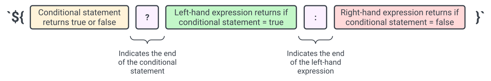

# Creating a HTML DOM Table from a JavaScript Object Array

Learn how to create an HTML table from a object array using JavaScript to read array items and instantiate DOM elements. 
___

This tutorial will go over the following:

1. Reading an object array from an external file
1. Checking and displaying the number of items in an object array
1. Creating a HTML DOM table to display the object array contents
2. Reusing code with template strings (optional)

Check out the source code on [Github](https://github.com/seumoo/dom-sample){:target="_blank"} 
and live version [here](https://seumoo.com/sample-code/dom-sample/index.html){:target="_blank"}.

## Prerequisites 

The following HTML and JavaScript concepts are used in this tutorial:

- [Creating a table using HTML](https://developer.mozilla.org/en-US/docs/Web/HTML/Element/table){:target="_blank"}
- [Using for loops in JavaScript](https://developer.mozilla.org/en-US/docs/Web/JavaScript/Reference/Statements/for){:target="_blank"}
- [Creating HTML DOM elements using JavaScript](https://developer.mozilla.org/en-US/docs/Web/API/Document/createElement){:target="_blank"}

To learn more about HTML DOM and how it is different from HTML, check out this [article](https://www.w3schools.com/js/js_htmldom.asp){:target="_blank"}.

## Reference Files

This tutorial uses the following files:

- `table_data.js`: contains a JavaScript object array of table data
- `dom_sample.js`: contains JavaScript functions to generates an HTML DOM table from an object array
- `index.html`: displays the HTML DOM table 
- `dom_sample.css`: basic styling for the HTML DOM table


Both `table_data.js` and `dom_sample.js` are embedded client-side using the `<script>` tag in `index.html`:

``` html
    <script type="text/javascript" src="table_data.js"></script>
    <script type="text/javascript" src="dom_sample.js"></script>
```

## Checking the Contents of the Object Array

The `table_data.js` file contains sample data in an object array:

``` js
const sample_table_data = [
    {
        "company": "Alton Realty",
        "title": "Accountant",
        "firstName": "Isabelle",
        ...
    },
    {
         "company": "Alton Realty",
        "title": "Accountant",
        "firstName": "Joy",
        ...
    },
    ...
```

We can import this object array into  the `dom_sample.js` file and start processing the objects. Additionally, we can check 
the number of objects in the array to ensure our DOM table has data to display. The function `getTableData()`
gets the object array from `table_data.js` by referencing the `sample_table_data` variable:

``` js hl_lines="6"
/**
 * Gets the sample data for the DOM table
 * @returns {Object[]} tableData - object array if length > 0; otherwise, null
 */
function getTableData() {
    const tableData = sample_table_data;       // object array from table_data.js imported via index.html
    console.log(tableData);                    // displays the object array in your developer console

    if (tableData.length <= 0) return null;    // if there are no items in the array, then return null
    else return tableData;                     // otherwise, return the JSON array
}
```

If there are no items in the object array, the function will return `null`. Otherwise, the function will return the object array.

### Displaying the Number of Items in the Object Array

We can display the number of objects in our array by creating a `<p>` element and attaching text to it. The function `createNotificationDom()` counts the number of objects in an object array and displays the array length in a `<p>` element using a [template string](https://developer.mozilla.org/en-US/docs/Web/JavaScript/Reference/Template_literals){:target="_blank"}:

``` js hl_lines="6 12"
/**
 * Counts the number of items in an object array and displays the count as a <p> element
 * @param {Object[]} tableDataArray - object array of table data
 */
function createNotificationDom(tableDataArray) {
    const notificationElement = document.createElement("p");

    if (tableDataArray === null || tableDataArray.length === 0) {
        notificationElement.innerText = "There is no data to display!";
    }
    else {
        notificationElement.innerText = `There are ${tableDataArray.length} items in the table:`;       // display table length using a template string
    }

    document.body.appendChild(notificationElement);     // attach the notification DOM to the body
}
```

## Creating the HTML DOM Table

Creating a HTML DOM table consists of the following steps:

1. Create a `<table>` element
2. Implement a loop to create a new table row `<tr>` for each object
3. Create table header elements `<th>` using the attributes from the first object in the array
4. Create table data elements `<td>` for each object in the array
5. Append `<tr>` elements to the `<table>` element
6. Append the `<table>` element to the document body

The figure below shows a tree of our resulting HTML DOM table:

<figure markdown>
  
  <figcaption>Tree of the HTML DOM table</figcaption>
</figure>

### Creating the Table DOM Element

Let's make a function to create a table DOM element. The `createTableDom()` function will accept an object array `tableDataArray`
and create a `<table>` element using `document.createElement()`:

``` js
/**
 * Creates a table <table> DOM element containing data from an object array. Appends the <table> element to the document body
 * @param {Object[]} tableDataArray - object array of table data
 */
function createTableDom(tableDataArray) {
    const tableElement = document.createElement("table");       // create the table DOM element
}
```

### Implementing a Loop to Process Objects

Next, we extend `createTableDom()` by implementing a `for` loop to help us process each object into a table header or data element:

``` js
// loop through each object in the object array
for (let index = 0; index < tableDataArray.length; index++) {
    const tableDataObject = tableDataArray[index];              // an object in the array

    // if this is the first item in the table, create table headers <th>
    if (index === 0) {
        // --- a function to process table headers <th>
    }

    // --- a function to process each object into a table row <tr>
}
```

### Creating the Table Header Row

We can make a function that creates `<th>` elements based on the attributes of the first object in the array. 
The `createTableHeader()` function does the following:

1. Creates a `<tr>` element to store all `<hr>` elements
2. Loops through each `key`attribute in `firstDataObject` and creates a `<th>` element
3. Sets the `<th>` inner HTML as the `key` text
4. Appends each `<th>` element to the `<tr>` element
5. After the loop finishes, `<tr>` is appended to the table DOM element, `tableDomElement`

``` js
/**
 * Creates a table row <tr> DOM element with table header <th> DOM elements. Appends the <tr> DOM element to a <table> DOM element
 * @param {Object} firstDataObject - first item of a object array
 * @param {HTMLElement} tableDomElement - <table> DOM element
 */
function createTableHeader(firstDataObject, tableDomElement) {
    const tableHeaderRowElement = document.createElement("tr");         // creates <tr> HTML DOM element

    for (const [key, value] of Object.entries(firstDataObject)) {
        const tableHeaderElement = document.createElement("th");        // creates <th> HTML DOM element
        tableHeaderElement.innerHTML = key;                             // sets the text contents of <th>
        tableHeaderRowElement.append(tableHeaderElement);               // appends the <th> element to the <tr> element
    }

    tableDomElement.append(tableHeaderRowElement);                      // appends <tr> to the <table> element
}
```

After creating the header elements, our DOM table currently looks like this:

<figure markdown>
  
  <figcaption>HTML DOM table with header elements only</figcaption>
</figure>

### Creating the Table Data Rows

Next, we can create another function which generates table data `<td>` elements for each value within an object. 
Similar to `createTableHeader()`, the `createTableData` function creates table data `<td>` elements and appends them to the 
`<tr>` element:

``` js
/**
 * Creates a table row <tr> DOM element with table data <td> DOM elements. Appends the <tr> DOM element to a <table> DOM element
 * @param {Object} dataItem - an object containing table data
 * @param {HTMLElement} tableDomElement - <table> DOM element
 */
function createTableData(dataItem, tableDomElement) {
    const tableRowElement = document.createElement("tr");             // creates <tr> HTML DOM element

    for (const [key, value] of Object.entries(dataItem)) {
        const tableDataElement = document.createElement("td");        // creates <td> HTML DOM element
        tableDataElement.innerHTML = value;                           // sets the text contents of <td>
        tableRowElement.append(tableDataElement);                     // appends the <td> element to the <tr> element
    }

    tableDomElement.append(tableRowElement);                          // appends <tr> to the <table> element
}
```

After creating the data elements, our DOM table looks like this:

<figure markdown>
  
  <figcaption>HTML DOM table with data elements</figcaption>
</figure>

### Creating the HTML DOM Table

We can now use our table header and data row functions to generate an HTML DOM table. Let's implement `createTableHeader()` and `createTableData()` into our table maker function `createTableDom()`:

``` js
/**
 * Creates a table <table> DOM element containing data from an object array. Appends the <table> element to the document body
 * @param {Object[]} tableDataArray - object array of table data
 */
function createTableDom(tableDataArray) {
    const tableElement = document.createElement("table");           // create the table DOM element

    // loop through each object in the object array
    for (let index = 0; index < tableDataArray.length; index++) {
        const tableDataObject = tableDataArray[index];              // an object in the array

        // if this is the first item in the table, create table headers <th>
        if (index === 0) {
            createTableHeader(tableDataObject, tableElement);
        }

        // process each item in the array into a table row <tr>
        createTableData(tableDataObject, tableElement);
    }

    document.body.appendChild(tableElement);                        // attach the table DOM to the body
}
```

Finally, we can create a function that display our table on the page by attaching the `<table>` element to the document body:

``` js
/**
 * Gets an object array and displays an HTML DOM table of the array contents
 */
function displayDomTable() {
    const tableDataArray = getTableData();       // get the object array which stores the table data
    createNotificationDom(tableDataArray);       // display the number of elements in the object array

    if (tableDataArray !== null) {
        createTableDom(tableDataArray);         // create an HTML DOM table using the objects in the array
    }
}
```

Call `displayDomTable()` at the end if your script and open `index.html`. Your page should now display an HTML table with contents
from the object array, similar to the [live version](https://seumoo.com/sample-code/dom-sample/index.html){:target="_blank"}.

## Code Reuse with Template Strings (Optional)
 
You may have noticed that the `createTableHeader()` and `createTableData` functions are very similar in scope: 

- Both functions attach either `<th>` or `<td>` elements to a `<tr>` element
- Both functions set the `innerHTML` text to either an object's `key` or `value`

The deciding factor that chooses between using a `<th>` or `<td>` is if we are currently processing a header row:

<figure markdown>
  
  <figcaption>Decision branch between creating a header or data row</figcaption>
</figure>

If we can include this deciding factor or "on/off switch" between processing a header or data row, we can use one function to create
our table row elements. 

### Setting a Boolean Argument

Let's reuse `createTableHeader()` and create a new function `createTableRow()`. 
Our new function will now accept an additional boolean argument `isHeader` which is the "on/off switch" for header processing:

``` js hl_lines="8"
/**
 * (Optional)
 * Creates a table header <th> or row <tr> DOM element. Appends the <tr> DOM element to a <table> DOM element
 * @param {Object} dataItem - an object containing table data
 * @param {HTMLElement} tableDomElement - <table> DOM element
 * @param {boolean} isHeader - true if object is processed as a header row; false if the object is processed as a data row
 */
function createTableRow(dataItem, tableDomElement, isHeader = false) {
    ...
}
```

By default, `isHeader` is false. When we call this function, we can manually set `isHeader` to true when we are processing a data row.

### Using Template Strings for Conditional Statements

Next, our function needs to create either `<th>` or `<td>` elements based on the `isHeader` value. We can implement `if...else` loops to resolve this conditional. However, we can also use [template strings](https://developer.mozilla.org/en-US/docs/Web/JavaScript/Reference/Template_literals){:target="_blank"} to make our code clearer and concise. For example, let's set the HTML tag name based on
`isHeader`:

=== "Using a template string"

    ``` js
    const tableDataTag = `${isHeader ? "th" : "td"}`;       // choose "th" if isHeader = true; else choose "td"
    ```

=== "Using a for...else loop"

    ``` js
    let tableDataTag;
    if (isHeader) tableDataTag = "th";      // choose "th" is isHeader is true
    else tableDataTag = "td";               // else, choose "td"
    ```

The following figure outlines a template string structure:

<figure markdown>
  
  <figcaption>Structure of a template string conditional</figcaption>
</figure>

In our example, `tableDataTag` equals `"th"` if `isHeader is true`. Otherwise, `tableDataTag` equals `"td"`. Next, we assign the inner HTML text with either the object's `key` or `value` by following the same template string structure: 

=== "Using a template string"

    ``` js
    tableDataElement.innerHTML = `${isHeader ? key : value}`;           // set the text contents of <td>
    ```

=== "Using a for...else loop"

    ``` js
    tableDataElement.innerHTML = value;
    if (isHeader) tableDataTag = key;      // set innerHTML as the key if processing headers
    ```

### Consolidating the Table Row Function

Finally, we can implement our changes into `createTableRow()`. The code snippet below shows `createTableRow()` with our template string
changes and `createTableHeader()` for comparison. Highlighted lines indicate lines added to `createTableRow()`:

=== "createTableRow()"

    ``` js hl_lines="3 6 7"
    function createTableRow(dataItem, tableDomElement, isHeader = false) {
        const tableRowElement = document.createElement("tr");                   // creates <tr> HTML DOM element
        const tableDataTag = `${isHeader ? "th" : "td"}`;                       // "th" if isHeader = true; else "td"

        for (const [key, value] of Object.entries(dataItem)) {
            const tableDataElement = document.createElement(tableDataTag);      // creates a <th> or <td> HTML DOM element
            tableDataElement.innerHTML = `${isHeader ? key : value}`;           // set the text contents of <td>
            tableRowElement.append(tableDataElement);                           // a the <td> element to the <tr> element
        }

        tableDomElement.append(tableRowElement);                                // append <tr> to the <table> element
    }
    ```

=== "createTableHeader()"

    ``` js
    function createTableHeader(firstDataObject, tableDomElement) {
        const tableHeaderRowElement = document.createElement("tr");         // creates <tr> HTML DOM element

        for (const [key, value] of Object.entries(firstDataObject)) {
            const tableHeaderElement = document.createElement("th");        // creates <th> HTML DOM element
            tableHeaderElement.innerHTML = key;                             // sets the text contents of <th>
            tableHeaderRowElement.append(tableHeaderElement);               // appends the <th> element to the <tr> element
        }

        tableDomElement.append(tableHeaderRowElement);                      // appends <tr> to the <table> element
    }
    ```
We can update `createDomTable()` to use `createTableRow()`:

``` js hl_lines="10 14"
function createTableDom(tableDataArray) {
    const tableElement = document.createElement("table");           // create the table DOM element

    // loop through each object in the object array
    for (let index = 0; index < tableDataArray.length; index++) {
        const tableDataObject = tableDataArray[index];              // an object in the array

        // if this is the first item in the table, create table headers <th>
        if (index === 0) {
            createTableRow(tableDataObject, tableElement, true);
        }

        // process each item in the array into a table row <tr>
        createTableRow(tableDataObject, tableElement);
    }

    document.body.appendChild(tableElement);     // attach the table DOM to the body
}
```
