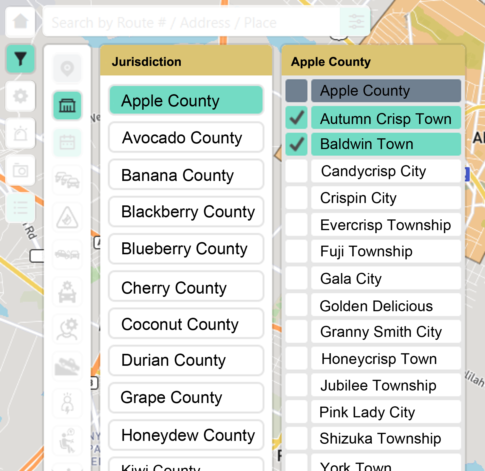
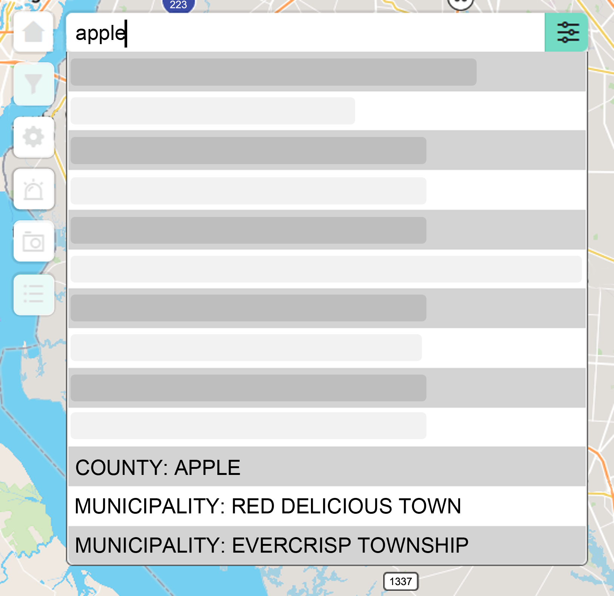

# Quick Start Guide to Exploring Fruit City Crashes
Learn how to navigate the map interface and query crash records in Fruit City.

*Disclaimer: The following guide is based on a real application I worked on. All data in the graphics uses imaginary data.*
___

This guide will go over the following:

1. Searching for a jurisdiction
2. Applying crash attributes to filter crashes
3. Exporting record data for further analysis

<figure markdown>
  
  <figcaption>One workflow when exploring Fruit City crashes.</figcaption>
</figure>

## Searching for a Location

This section will go over searching and selecting a jurisdiction.

### Search for a Jurisdiction

Jurisdictions including counties and municipalities can be searched in by using the Filter Menu or Search Bar.

=== "Filter Menu"

    1. Click the :filter-fill: Filter Menu located on the left side of the map.
    1. Click the :government-line: Jurisdiction Menu to open options for counties and municipalities.
    1. Select one or more jurisdictions. The map will automatically display crashes based on your selections.

    !!! info

        You cannot select a mix of counties and municipalities. When selecting counties, all municipality options will be disabled and vice versa.

    <figure markdown>
      { width="500" }
      <figcaption>Jurisdiction select using the Filter Menu. Counties will be disabled when municipalities are selected and vice versa.</figcaption>
    </figure>

=== "Search Bar"

    1. Type the jurisdiction in the Search Bar to view a list of options based on your query.
    1. Click on a "COUNTY" or "MUNICIPALITY" option. The map will zoom to the jurisdition and display crashes based on your selection.

    !!! info

        The Search Bar can support one selection at a time. To select multiple jurisdictions, use the :government-line: Jurisdiction Menu from the :filter-fill: Filter Menu after selecting a "COUNTY" or "MUNICIPALITY" option.

    <figure markdown>
      { width="500" }
      <figcaption>Jurisdiction select using the Search Bar</figcaption>
    </figure>

## Filter Crashes using Crash Attributes

Crash attributes are particular characteristics of a crash such as:

- Alcohol Use: yes, no
- Weather Condition: rain, snow, fog
- Contributing Factor: driver distracted, following too closely, fell asleep

To apply filters:

1. Click the :filter-fill: Filter Menu to display various filter categories.
2. Click on a category to display a menu of individual filters.
3. Select any number of filters. Your selections will be highlighted in green and the map will automatically refresh to display crashes with your selected filters. 

<figure markdown>
  
  <figcaption>Selecting various filters from the Filter Menu will automatically refresh crashes within your map view.</figcaption>
</figure>

??? summary "How crashes are queried when multiple filter categories are selected"

    When individual filters under the same category are selected, crashes will be queried with the individual filters appended with an "OR" clause. For example: 

    - Selecting "Wet", "Snowy", and "Icy" under the Road Condition category will query crashes with Road Condition of "Wet" OR "Snowy" OR "Icy".

    <figure markdown>
      
      <figcaption>How crashes are queried when selecting filters under the same category.</figcaption>
    </figure>
    

    When selecting filters across multiple categories, crashes will be queried with the individual filters within each category appended with an "AND" clause. For example:

    - Selecting "Wet", "Snowy", and "Icy" under the Road Condition category **and** "Fatal Injury" and "Possible Injury" under the Pedestrian Physical Condition category will query crashes with (Road Condition of "Wet" OR "Snowy" OR "Icy") **and** (Pedestrian Physical Condition of "Fatal Injury" OR "Possible Injury").

    <figure markdown>
      
      <figcaption>How crashes are queried when selecting filters across multiple categories.</figcaption>
    </figure> 

## Export Crash Records to CSV

Crash records can be exported as a CSV file for further analysis. The exported crash records are based on the crashes currently visible in your map view. To export crash records:

1. Move your map view to encompass all crash records you want to export.
2. Open the :list-settings-fill: Results Display on the bottom-left of the map interface if not opened already. 
3. Click :folder-zip-line: Export Records. The application will take time preparing your export depending on how many crash records are in your map view.
4. Agree to the disclaimer to download a CSV file of crash record data.
